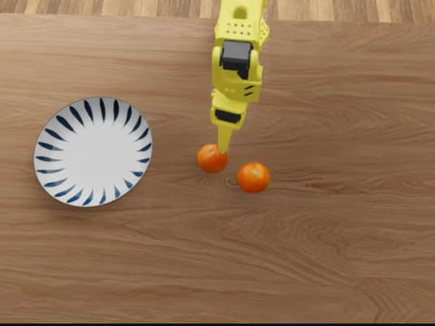
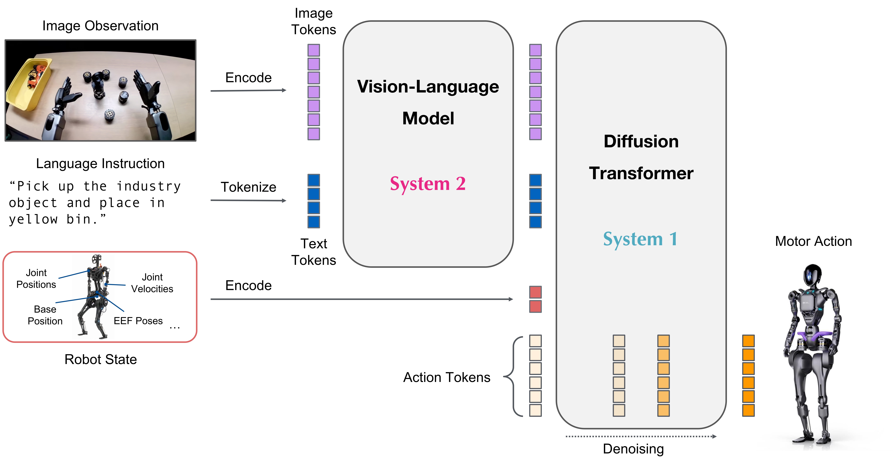
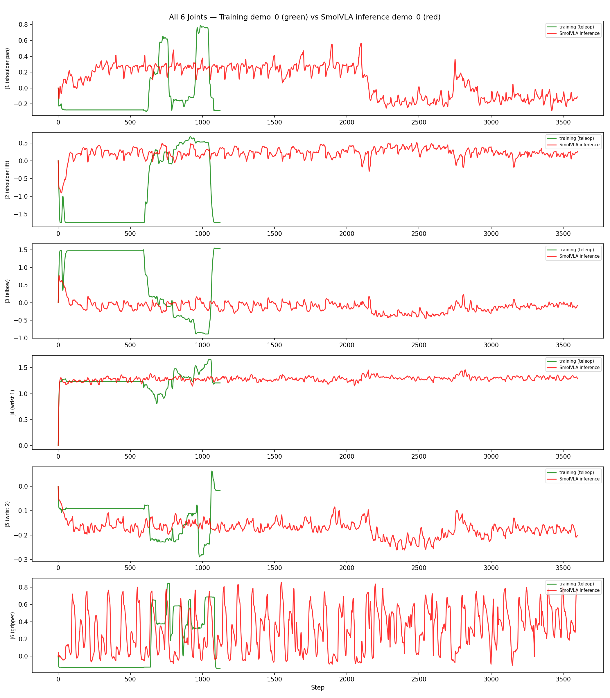
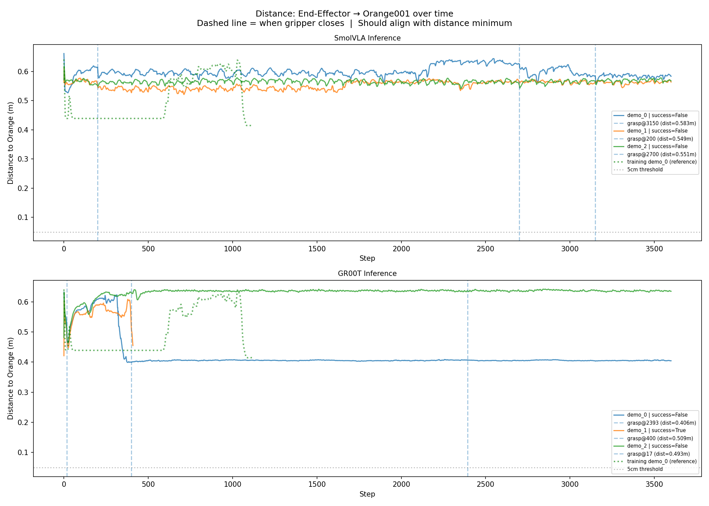
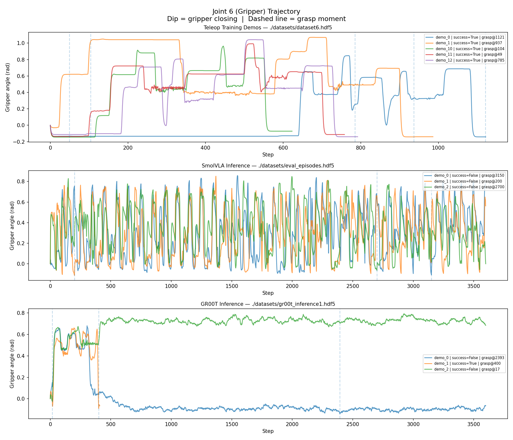
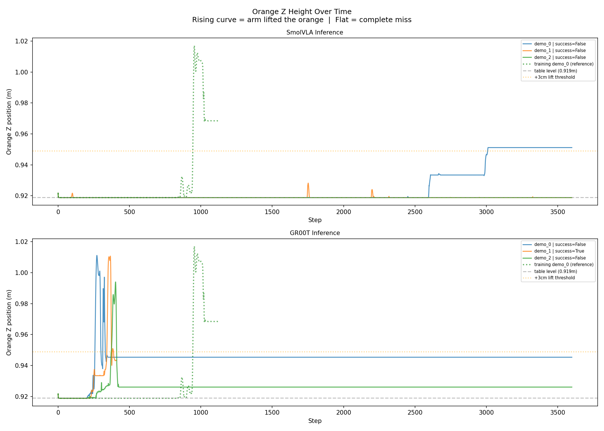
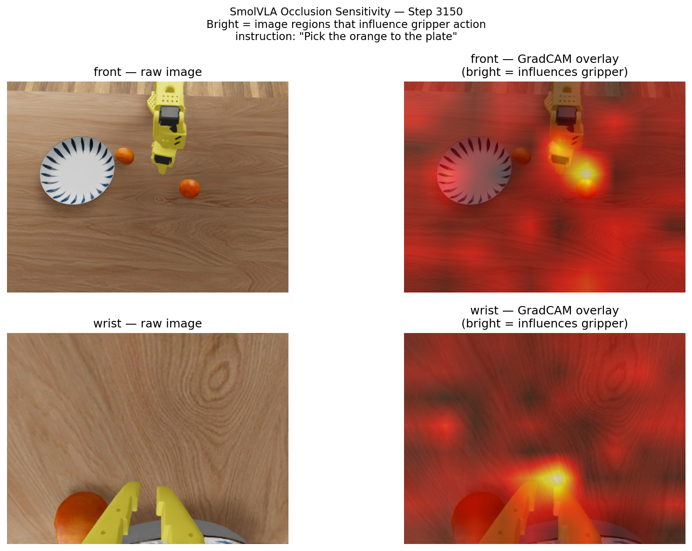

# VLA Policy Research: GR00T N1.5, SmolVLA inference on SO-101 Pick-Orange Task

**Author:** Hemanth Mandava | **April 2026**  
**Theme:** VLA Models Testing for Robotic Manipulation?

**Live Results:**
- [GR00T Inference Episode](https://huggingface.co/spaces/lerobot/visualize_dataset?path=%2Fmvhk%2Fso101_gr00t_inference%2Fepisode_0) — successful two-orange pick-and-place
- [SmolVLA Result](https://huggingface.co/spaces/lerobot/visualize_dataset?path=%2Fmvhk%2Fso101_test_orange_pick%2Fepisode_0) — smol model inference
- [Training Dataset](https://huggingface.co/datasets/mvhk/so101_test_orange_pick) — teleoperated demos

---

## What I Built

A complete robotics pipeline inside NVIDIA Isaac Sim: teleop → record → train → evaluate.

```
Isaac Sim (SO-101 arm, kitchen scene)
        │
   Teleoperation (physical leader arm)
        │
   HDF5 recordings → LeRobot v3 format → HuggingFace dataset
        │
   Fine-tune VLA policy (GR00T N1.5 or SmolVLA)
        │
   Policy server (ZMQ / gRPC) ← → Isaac Sim inference loop
        │
   Automated success detection + episode logging
```

**Task:** Pick two oranges from a counter and place them on a plate — a multi-step sequential task with domain randomization (±3cm object position, ±2.5° camera angle per episode).




The entire scene — robot, objects, lighting, physics — is built programmatically in Python inside Isaac Sim's Script Editor. No manual drag-and-drop: one script spawns and positions everything reproducibly.


---

## Results

| | GR00T N1.5 | SmolVLA |
|---|---|---|
| **Parameters** | 3B total | 450M total (~100M action expert + ~350M SmolVLM2 backbone) |
| **Pretrained on robot data** | Yes — millions of NVIDIA manipulation demos | Yes — but only ~30k LeRobot community episodes (orders of magnitude smaller) |
| **VLM backbone** | NVIDIA Eagle-2 | SmolVLM2 (SigLIP + SmolLM2), first half of layers only |
| **Fine-tuning steps needed** | 10,000 | 100,000 |
| **Action head** | Flow-matching diffusion (4 denoising steps) | Flow-matching action expert (chunks of 50 actions) |
| **Action horizon** | 16 steps (~0.27s) — reactive | 50 steps (~0.83s) — slower to re-plan |
| **Visual encoding** | 224 * 224 native, full token budget | 64 visual tokens per frame (heavy compression, no tiling) |
| **Task completion** | **Successful** | **Did not complete reliably** |

> **Note:** Both models use flow matching for the action head — the gap is **not** architectural. The decisive differences are (a) the size and domain of robot pretraining and (b) the visual token budget, not "diffusion vs autoregressive."

---

## Why GR00T Worked

**1. Strong pretrained prior.**
GR00T was pretrained on millions of manipulation demos. Fine-tuning only redirects existing knowledge — it doesn't teach grasping from scratch. This is why loss dropped from 0.71 → 0.13 in just 100 steps. SmolVLA was also robot-pretrained, but on ~30k community episodes — enough to learn what robots and grippers look like, not enough to encode reliable manipulation dynamics for novel tasks.

**2. Flow-matching action head with a strong prior.**
GR00T samples from a learned trajectory distribution via 4-step denoising, producing smooth, physically valid motions that handle domain randomization without jittering. SmolVLA's action expert is also flow-matching, but with a weak manipulation prior the same architecture collapses to mean-pose predictions (see Findings 1–2).



The key insight: the VLM processes camera images + language instruction → the Diffusion Transformer generates a physically smooth action trajectory. These two systems together enable both high-level task understanding and precise motor control.

**3. Short action horizon = frequent visual re-planning.**
At 16 steps per chunk (~0.27s), the policy re-queries cameras ~110 times over a 30-second task. Each re-plan corrects for orange position drift from domain randomization.


After 7,000–10,000 fine-tuning steps, GR00T's predicted joint trajectories closely follow the teleoperated ground truth across all 6 joints. The model converges this fast because the pretrained prior already encodes manipulation dynamics.

---

## Why SmolVLA Didn't Work — Confirmed by Debug Analysis

These failures were verified using custom debug scripts that plot joint trajectories, end-effector distance to the orange, and orange height from recorded HDF5 inference episodes.

### Finding 1: Arm never reaches the orange



Joints J1–J5 (arm): SmolVLA (red) produces nearly flat lines throughout the entire episode — the arm barely moves from its starting position. Training demos (green) show clear, purposeful excursions toward the orange and plate.

**Root cause:** SmolVLA collapsed to predicting near-mean arm joint values. The model learned that the average arm pose across all training steps was "safe" but never learned directed reaching.



End-effector stays 0.5–0.65m from the orange the whole episode. When the gripper "closes" (dashed line), it is 0.34–0.54m away — nowhere near contact.

### Finding 2: Gripper oscillates instead of grasping



- **SmolVLA (middle):** Gripper rapidly oscillates open↔closed every ~20–50 steps for the entire 3600-step episode. It never cleanly closes and holds.
- **GR00T (bottom):** Gripper closes at a specific step, holds during transport, opens to release. Clean temporal structure.
- **Training demos (top):** Same clean close-hold-open pattern as GR00T.

**Root cause:** SmolVLA has no temporal task understanding for this task. Its small (~30k-episode) pretraining corpus did not provide enough phase-conditioned manipulation experience, so the flow-matching expert cannot distinguish task phases (approaching / grasping / placing). Each action chunk mixes open and close commands — averaging over all phases seen in training simultaneously.

### Finding 3: Orange never leaves the table



- **SmolVLA (top):** Orange stays at table level (~0.919m) for all episodes. No successful lift.
- **GR00T (bottom):** On successful episodes, orange Z rises to ~1.0m and stays elevated.

Direct physical consequence of Findings 1 and 2: arm never reaches → gripper never contacts → orange never moves.

### Finding 4: SmolVLA sees the orange but doesn't reach for it
**Grad-CAM (Gradient-weighted Class Activation Mapping)** on SmolVLA is used to interpret which parts of an input image (from robot cameras) the model focuses on when generating actions.



The GradCAM/occlusion sensitivity map shows SmolVLA IS attending to the orange (bright red on the orange in both front and wrist views). The model can see it — but still outputs near-constant arm joint values. This confirms the failure is not a visual perception problem but a **learned motor policy problem**: the model sees the orange and still doesn't know how to move the arm toward it.

### Finding 5: Action horizon bug freezes the robot for 1.67s at a time

`run_inference.sh` passed `--policy_action_horizon=100`, but SmolVLA generates 50 actions per chunk. When the async gRPC server hasn't finished computing, the client repeats the last joint position **100 times** (1.67s at 60Hz), interrupting any partial reaching motion.

```bash
# Bug:   --policy_action_horizon=100
# Fix:   --policy_action_horizon=50   ← matches SmolVLA's actual chunk_size
#        --policy_language_instruction="Pick both oranges and place them on the plate"
```

---


## Camera Learnings

**What worked:**
- **Dual cameras are non-negotiable.** Front camera gives global context (where are the oranges, where is the plate). Wrist camera gives grasping precision (is the gripper aligned). Without both, reliable pick-and-place is not achievable.
- **Native 640×480 resolution.** GR00T's wrist view at full resolution can detect the orange edge position to within ~1–2px (~2mm spatial precision) — enough for consistent grasps.
- **Camera domain randomization** (±2.5cm, ±2.5°) forced the policy to generalize beyond a fixed viewpoint. Essential for any real-world deployment.

**What didn't work:**
- **SmolVLA's 64-token-per-frame visual budget.** The SmolVLM2 backbone keeps only ~64 visual tokens per frame (no tiling, global image only) and uses just the first half of its VLM layers. The effective spatial resolution after this compression is far below the 640×480 input — a 7cm orange in the wrist view ends up represented by 1–2 tokens at most, which is not enough to localise the contact point for grasping. GR00T's Eagle-2 backbone keeps a much larger token budget and preserves fine wrist-camera detail.
- **Single-camera setups** (tested early) — without wrist view, the policy couldn't distinguish "gripper above orange" from "gripper beside orange."
- **Camera jitter** in early simulations caused motion blur in wrist frames and corrupted demonstrations. Fixed by constraining the wrist camera rigid body attachment in USD.

---

## Key Lessons

1. **Pretrained priors beat training steps.** 10k steps with GR00T > 150k steps with SmolVLA. Invest in the right foundation model, not more compute.

2. **Data quality matters.** You need to perform consistent motions for effective training. 75 clean episodes with a consistent grasp strategy outperformed 81 episodes with mixed techniques. The policy learns exactly what you show it, including your bad habits.

3. **Configuration mismatches silently break multi-step tasks.** The action horizon bug caused 1.67s freezes with no error message. Always verify: `model config chunk_size == server chunk_size == --policy_action_horizon`.

4. **Debug with physics, not just loss curves.** Training loss told us nothing about why SmolVLA failed. Plotting orange Z height, end-effector distance, and joint trajectories revealed the reasons for failure.

5. **GradCAM proves perception is fine — the problem is the motor policy.** SmolVLA sees the orange correctly but doesn't reach for it. Knowing this rules out entire categories of fixes (more data, better cameras) and points directly at the pretraining corpus, not the action-head family.

6. **Teleoperation lag degrades demo quality.** LeRobot's `record_loop` couples camera capture, dataset writing, and teleop in one synchronous loop. Camera I/O blocks action forwarding, causing the follower to lag behind the leader. Had to move slowly during recording to keep demonstrations clean.

7. **Simulation-first development works.** The entire pipeline — teleop, training, evaluation, debugging — ran in Isaac Sim before any real hardware. This compresses weeks of physical robot testing into hours.

---

## How to Effectively Fine-Tune SmolVLA / GR00T

These are the rules that actually moved the needle in our runs, cross-referenced against the LeRobot docs and the SmolVLA paper (arXiv 2506.01844).

**1. Coverage > episode count.**
The official recommendation is ~50 episodes structured as repeated coverage per variation (e.g., 5 object positions × 10 episodes each). 25 episodes underperformed in the LeRobot reference example;  **Plan the variation grid before you start recording**, don't just record more.

**2. Hyperparameters that worked.**
- Learning rate: **1e-4** with cosine decay to ~2.5e-6 (matches SmolVLA pretraining schedule).
- Warmup: ~100 steps.
- Batch size: 64 , Increase only if step time stays short.
- Steps: ~20k on a 50-episode dataset is the LeRobot reference (~4 h on A100). Going further only helped when more variation was added — pushing SmolVLA from 20k → 150k steps on the same data did **not** rescue the failure modes documented above.

**3. Match chunk_size everywhere.**
SmolVLA's action expert outputs chunks of n=50. Set `--policy_action_horizon=50` on the inference client, and confirm the server's `chunk_size` and the model config agree. Any mismatch turns into multi-second hold-last-action freezes (Finding 5).

**4. Don't fight the visual bottleneck — feed it the right pixels.**
SmolVLA keeps only ~64 visual tokens per frame and uses only the first half of the VLM. Crop the workspace tightly, keep the wrist camera rigidly attached, and avoid scenes where the target object is small relative to the frame. You cannot recover lost spatial detail by training longer.

**5. If GR00T is an option for the task, prefer it.**
For real manipulation tasks, the GR00T-class pretraining corpus is currently the dominant factor. SmolVLA is the right choice when you need <1 GPU inference, edge deployment, or tasks close to its community-data distribution — not for novel multi-step manipulation from a small demo set.

**6. Always sanity-check the policy with physics-grounded plots, not loss alone.**
Before declaring a fine-tune successful, plot end-effector→target distance, target Z-height, and gripper open/close transitions. A converged loss with a flat end-effector trajectory means the model collapsed to mean actions (Finding 1).


---


---

*All experiments conducted in NVIDIA Isaac Sim using the LeIsaac / LeRobot / HuggingFace.*
