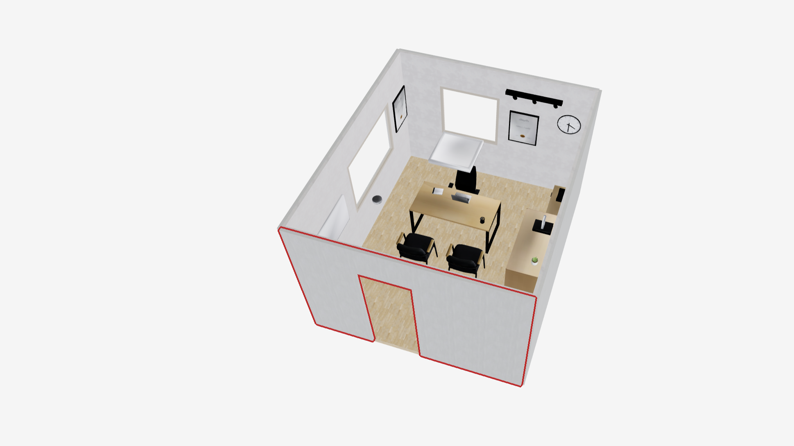

# SceneSmith — Agentic AI for Scene Generation
**Accelerating VLA data collection · Eliminating scene-authoring downtime in MuJoCo & Isaac Sim**




> Demo video: [`images/scenesmithroom.mp4`](images/scenesmithroom.mp4)

---

## How SceneSmith enables a LeRobot arm to move

To train or evaluate a LeRobot arm in simulation, you need a *physics-ready, manipulable* scene — a room with separable objects, correct masses and frictions, working collision meshes, and proper articulation on doors and drawers. SceneSmith produces all of that from a single text prompt, then exports it to the simulator the policy will run in (MuJoCo or Isaac Sim). The arm can then `step()` through the scene immediately — no manual asset plumbing between scene and policy.

---

## The bottleneck it removes

Training Vision-Language-Action (VLA) policies needs **thousands of diverse, physics-ready indoor scenes**. Today, every scene is hand-authored: model the room in Blender or a CAD tool, place objects, tune masses and frictions, generate collision meshes, then convert to MuJoCo XML *and* Isaac Sim USD. **One scene easily costs 1–3 engineer-days**, and the pipeline stalls every time a new room is needed.

SceneSmith collapses this from days to minutes — a single prompt yields a fully simulation-ready scene in Drake, MuJoCo, and Isaac Sim formats.

---

## How it works

A team of VLM agents — **designer · critic · orchestrator** — iterate over four stages:

```
prompt → architectural layout → furniture → wall/ceiling objects → manipulables → sim-ready scene
```

At every stage the designer proposes placements, the critic checks realism and physics, the orchestrator drives the loop until quality gates pass.

| Asset class | Method |
|---|---|
| Static furniture & props | Text-to-3D synthesis (SAM3D — real meshes from AI-generated images) |
| Articulated objects (cabinets, drawers) | Dataset retrieval (ArtVIP, PartNet-Mobility) via CLIP search |
| Physical properties | VLM-estimated mass, friction, inertia per object |
| Collision geometry | VHACD convex decomposition (fast and stable for sim) |

Every object is **separable, physically parameterized, and ready to simulate** — no manual cleanup.

---

## Native multi-simulator export

| Simulator | Format | Why it matters |
|---|---|---|
| Drake | `.dmd.yaml` + `.sdf` | Native, highest fidelity |
| **MuJoCo** | `.xml` | Fast physics for RL / large-scale rollouts |
| **Isaac Sim** | `.usd` | GPU-accelerated photoreal sensor sim, multi-env training |

A single SceneSmith run lands you ready-to-`step()` environments in **both** simulators — no per-format conversion pass, no broken collision meshes, no missing inertias.

---

## Impact on the VLA data-collection loop

```
prompt batch  →  SceneSmith  →  N varied rooms  →  policy rollouts  →  VLM success eval  →  HF dataset
   (minutes)      (parallel)        (MuJoCo / Isaac Sim)               (auto)            (LeRobot)
```

What this changes for a pipeline like our XLeRobot conference-cleanup setup:

- **Scene authoring time:** days → minutes per environment
- **Variation:** hand-tuned single room → hundreds of prompt-driven variants for domain randomization
- **Format friction:** manual MuJoCo↔Isaac Sim conversion → both emitted in one pass
- **Engineer focus:** shifts from asset plumbing to policy design and dataset curation

---

## Quality (vs. prior scene-generation methods)

| Metric | SceneSmith | Prior |
|---|---|---|
| Objects per scene | **3–6× more** | sparse |
| Inter-object collisions | **< 2%** | higher |
| Physics stability | **96%** of objects stable | lower |
| Realism (user study, n = 205) | **92% win rate** | — |
| Prompt faithfulness | **91% win rate** | — |

---

## What it eliminates

- Manual scene authoring
- Per-object physics tuning
- Simulator-specific asset conversion (XML / USD round-trips)
- Human-in-the-loop quality checking — the critic agent does it

---

*Open source — code, checkpoints, data: github.com/nepfaff/scenesmith · Paper: arxiv.org/abs/2602.09153*
